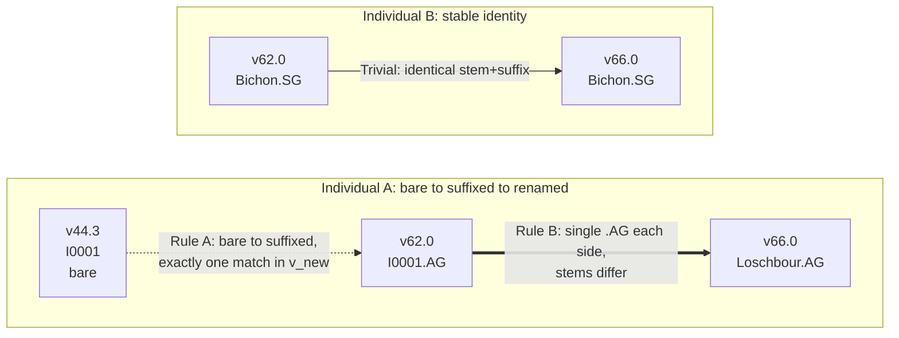
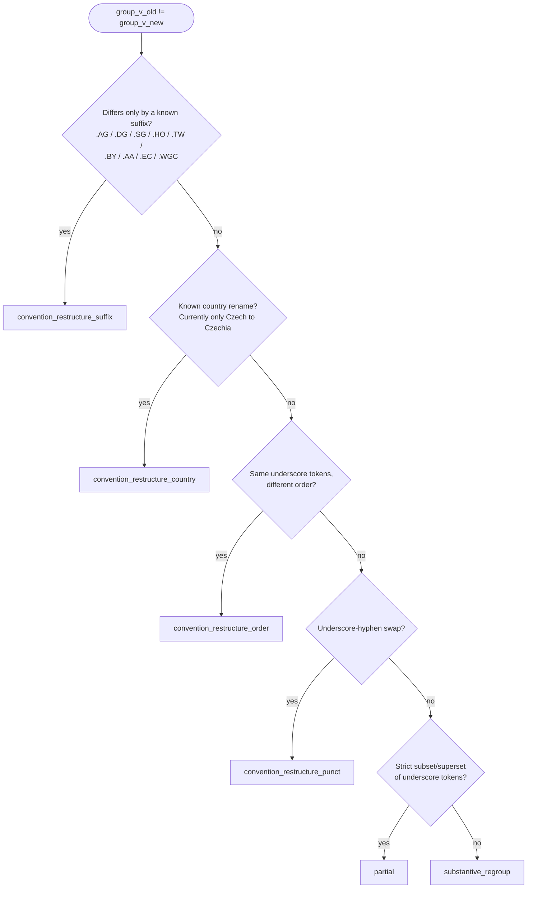
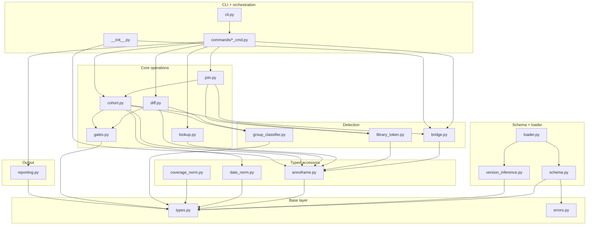

# aadr-resolve: developer orientation

This document orients a new contributor to the `aadr-resolve` codebase.
README.md covers user-facing CLI/library usage; CONTRIBUTING.md covers
the procedural side (setup, tests, releases). DEVELOPMENT.md is the
architecture tour: what the modules are, how data flows through them,
and the invariants you need to know before changing anything.

Module paths throughout are relative to `src/aadr_resolve/`.

## Table of contents

- [1. Mental model](#1-mental-model)
- [2. Module map](#2-module-map)
- [3. Data flow per subcommand](#3-data-flow-per-subcommand)
- [4. Key abstractions](#4-key-abstractions)
- [5. Invariants and behavioral pins](#5-invariants-and-behavioral-pins)
- [6. Testing strategy](#6-testing-strategy)
- [7. Gotchas](#7-gotchas)
- [8. Roadmap](#8-roadmap)

## 1. Mental model

### What the tool does

AADR (Allen Ancient DNA Resource) is a public ancient-DNA genotype
dataset distributed as periodic `.anno` companion files alongside
genotype data. Every ancient-DNA pipeline needs to join samples across
AADR releases (e.g., re-run a 2022 cohort against a 2025 release).
That join is non-trivial — most pipelines re-implement it with custom
`awk`. `aadr-resolve` standardizes it.

### The two structural quirks

1. **Progressive de-anonymization.** Early releases used anonymous
   lab-internal IDs (`I0001`); later releases promoted samples to
   publication names (`Loschbour.AG`). Same physical individual,
   different ID string.
2. **Periodic Master-ID renames.** Between consecutive AADR releases,
   9–18 individuals get their cross-version-stable ID renamed; ~62
   cumulative events between v44.3 and v66.0. A naive equi-join on
   `individual_id` silently drops these.

### The three-ID model

AADR has three distinct identifier concepts. Conflating them breaks
the join:

| Concept | Scope | Example | Stable across versions? |
|---------|-------|---------|--------------------------|
| `genetic_id` | per-row | `Loschbour.AG`, `Loschbour.DG` | No — renamed |
| `individual_id` | per physical individual (the join key) | `Loschbour` (was `I0001`) | Mostly — bridge corrects |
| `persistent_genetic_id` | per-row, v66+ only | `33` | Yes (introduced v66) |

`individual_id` was called "Master ID" in v44–v62 and renamed to
"Individual ID" in v66. **One IID maps to one-or-more GIDs** (one per
library / data-type). Within-version multi-row-per-IID is normal data
shape — 951–2969 IIDs per version have multiple rows. Not an error.

`persistent_genetic_id` is row-level. It is NOT a substitute for the
IID join because one individual has multiple PGIDs.

### Schema classes A–E

AADR's `.anno` column layout changed non-monotonically across
releases. Five classes — generated from real `.anno` headers by
[`scripts/gen_schemas.py`](scripts/gen_schemas.py) across releases
v44.3, v50.0, v52.2, v54.1, v62.0, v66.0 — are pinned in
`src/aadr_resolve/schemas/class_{A..E}.yaml` (shipped in the wheel):

| Class | Versions | ncols | Distinctive feature |
|-------|----------|-------|---------------------|
| A | v44.3, v50.0 | 43–44 | `Index` col; GID is "Version ID" at col 2 |
| B | v52.2 | 48 | GID renamed to "Genetic ID"; still has `Index` |
| C | v54.1 | 36 | 12 cols dropped from B (incl. `Index`) |
| D | v62.0 | 42 | Cols re-added; class C names; no native coverage column |
| E | v66.0 | 49 | Master ID → Individual ID; `Persistent Genetic ID` at col 2 |

Auto-detection signature is `(ncols, normalize(col[0]), normalize(col[1]))`
— unique per class. The non-monotonicity at C means downstream code
must tolerate "field absent in this class" (see the
`MissingNativeFieldError` exception).

### MID-rename bridge and the GID-stability rule

Two-step algorithm:

1. For each consecutive `(af_old, af_new)` version pair, build
   `gid -> iid` for each. For every GID present in both, if
   `gid_to_mid_old[gid] != gid_to_mid_new[gid]`, record a
   `MIDRenameEvent` keyed on the shared GID. Deterministic, single-
   pass, no human input.
2. When joining, apply the rename map so a query for `Loschbour` in
   v66 also matches `I0001` in v44 / v50 / v52 / v54.

Cross-lab collision is the failure mode: if `(v_old, mid_old)` maps
to two distinct `mid_new` in `v_new` via different shared GIDs, that's
an exit-3 invariant violation under default
`--on-mid-collision=error`; `warn` continues with affected rows
flagged `library_chain_ambiguous`. None observed across six bench-
verified versions; the check is defensive.

### Library-token chain rules

Within an `individual_id_canonical` scope (post-MID-bridge), AADR
routinely tracks multiple sequencing libraries per individual.
`aadr-resolve` emits **one row per (individual × library)** by
default and chains library identity across versions with two named
rules plus trivial pairing:

- **Trivial** — identical `(stem, suffix)` across versions → same
  library.
- **Rule A — bare-to-suffixed promotion.** Bare-numeric GID with stem
  X in v_old plus suffixed GID with the same stem (any suffix class)
  in v_new → same library. Captures `I0001` → `I0001.AG`.
- **Rule B — same-suffix-class single-library bridge.** Suffix class
  has exactly one GID in each of two versions, stems differ → same
  library (the stem changed because the MID renamed). Captures
  `I0001.AG` → `Loschbour.AG`.

Implemented as union-find over `(version, gid)` nodes in
`library_token.build_library_identity`. The emitted `library_token`
string is the most-recent-version's full GID for the chain — chosen
because stems alone collide between suffix classes, and suffix-only
strings collide within a suffix class, but a full GID is unique.

Worked examples — Individual A demonstrates the canonical Rule
A + Rule B chain (single-library individual whose ID was promoted
then renamed); Individual B demonstrates Trivial pairing for a
library whose ID never changed:

Note that Rule A and Rule B both require exactly one candidate in
the receiving version — when an individual has multiple libraries
of the same suffix class, the chain only forms for that class if
the algorithm can unambiguously pair them.

### Six group_id-change classes

Naive `group_v_old != group_v_new` emits ~16k events at v62→v66 (100%
of shared individuals); 99% are noise. `group_classifier.py` walks
classes in fixed priority order, first match wins:

1. `convention_restructure_suffix` — old equals new ± a
   `.AG`/`.SG`/`.DG`/`.HO`/… suffix
2. `convention_restructure_country` — `Czech_*` → `Czechia_*` (known
   list)
3. `convention_restructure_order` — same underscore tokens, different
   order
4. `convention_restructure_punct` — `_` ↔ `-` swap
5. `partial` — components are a strict subset/superset
6. `substantive_regroup` — the actually-interesting catchall

**Reordering the list changes results** — e.g., a `Czech_BA` →
`Czechia_BronzeAge` transition matches `convention_restructure_country`
under the current order, but would match `convention_restructure_order`
(misleadingly) if the country rule ran after the token-reorder
check. The order is treated as part of the public contract: changing
it would silently reclassify previously-stable events. Bump a
minor version and call it out in the changelog if the order ever
needs to change.

The first-match-wins pipeline visualized:

## 2. Module map

17 modules, ~5000 LOC. Organized in dependency layers, bottom-up:

Cross-layer edges shown; almost every module also imports from
`types` (and many from `errors`) — those edges are omitted from the
diagram for legibility but are listed in the per-module table
below. The "Imports" column lists top-level imports only — a few
modules defer specific imports into method bodies to break circular
deps (e.g., `annoframe.AnnoFrame.from_path` does a local
`from .loader import read_anno`); those are noted as "(local)".

| Module | Concern | Imports |
|--------|---------|---------|
| `types.py` | All shared dataclasses + enums | (stdlib only) |
| `errors.py` | Exception hierarchy + exit codes | (stdlib only) |
| `schema.py` | YAML registry load + signature dispatch | `types`, `errors` |
| `schemas/*.yaml` | Per-class field maps (ship in the wheel) | — |
| `version_inference.py` | Filename → version label | `types`, `errors` |
| `loader.py` | End-to-end `.anno` reader | `types`, `errors`, `schema`, `version_inference`; `annoframe` (local) |
| `annoframe.py` | Typed accessor over loaded `.anno` | `types`; `loader`, `date_norm`, `coverage_norm` (local) |
| `date_norm.py` | Int64-nullable date normalization | `types` |
| `coverage_norm.py` | Float64 coverage with per-class routing | `types`, `errors` |
| `bridge.py` | MID-rename detection + manual overrides | `types`, `errors`, `annoframe` |
| `library_token.py` | Cross-version library identity chain | `types`, `annoframe` |
| `group_classifier.py` | Six-class group_id-change classification | `types` |
| `lookup.py` | Single-sample resolution business logic | `types`, `annoframe` |
| `diff.py` | Diff computation + per-event streaming | `types`, `annoframe`, `gates`, `group_classifier` |
| `cohort.py` | Cohort manifest construction (the biggest) | `types`, `errors`, `annoframe`, `date_norm`, `gates`, `group_classifier`, `library_token` |
| `join.py` | Wide-form pairwise table (thin wrapper over cohort) | `types`, `annoframe`, `bridge`, `cohort`, `library_token` |
| `gates.py` | All exit-1 validation gates | `types` |
| `reporting.py` | TSV/JSON writers + stdout summary renderer | `types` |
| `cli.py` | Click root group + `main()` + exit-code mapping | `errors`, `schema`, `types`, `commands/*` |
| `commands/*.py` | Thin click wrappers per subcommand | core modules + `reporting` + `gates` |
| `__init__.py` | Library API surface (`resolve_*` functions, re-exports) | most of the above |
| `__main__.py` | `python -m aadr_resolve` shim | `cli` |

Note that `MIDBridge` is defined in `types.py`, not in `bridge.py`,
so several modules that operate on bridges (e.g., `library_token`,
`lookup`, `gates`) take a `MIDBridge` from `.types` without importing
`bridge.py` at all. `bridge.py` is only imported where the
*construction* functions (`detect_bridge`, `load_manual_bridge`,
`merge_with_overrides`, `compute_canonical_version`) are needed.

### Layers

**Data-model + type layer** (`types.py`, `errors.py`). Pure
dataclasses and enums, no I/O, no logic. The base for everything
else. Add a new shared shape here and re-export it from `__init__.py`
if it's library-API surface.

**Schema + loader layer** (`schema.py`, `schemas/*.yaml`,
`version_inference.py`, `loader.py`). The bottom-half of `.anno`
reading: detect the class from the header, infer the version from the
filename, hand off to pandas with strict reader flags, drop phantom
columns. The only entry point is `loader.read_anno`, called by
`AnnoFrame.from_path`.

**Typed accessors** (`annoframe.py`, `date_norm.py`,
`coverage_norm.py`). `AnnoFrame` is the central library type — every
core module operates on `AnnoFrame` instances rather than raw
DataFrames. The two `*_norm` modules supply the Int64/Float64 casts
that wrap pandas's string-dtype reads.

**Detection layer** (`bridge.py`, `library_token.py`,
`group_classifier.py`). Pure-ish functions over one or more
`AnnoFrame`s that produce the cross-version structures: the
MID-rename bridge, the per-individual library chains, the
group-change class labels.

**Core operations layer** (`lookup.py`, `diff.py`, `cohort.py`,
`join.py`, `gates.py`). One module per subcommand's business logic
(plus `gates` cross-cutting). All take `AnnoFrame`s and produce typed
result objects (`LookupResult`, `DiffResult`, `CohortManifest`,
gate-result dataclasses). No I/O.

**Output layer** (`reporting.py`). TSV/JSON writers + the stdout
summary renderer. Single point of contact for output formatting.

**CLI + orchestration** (`cli.py`, `commands/*.py`, `__init__.py`,
`__main__.py`). The click wiring + the public library API. Each
`commands/*_cmd.py` is a thin wrapper around its core module: parse
options → build AnnoFrames + bridge → call core function → write
output → evaluate gates → optionally emit summary/sidecars → raise on
fail-state accumulation.

## 3. Data flow per subcommand

### `lookup`

`commands/lookup_cmd.py` → `lookup.py`

1. Click parses positional `query` + repeatable `--anno-files`.
2. Each path loaded via `AnnoFrame.from_path`.
3. `bridge.detect_bridge(anno_frames, on_collision=…)` builds the
   auto-detected bridge.
4. `--mid-bridge` overrides layered via `bridge.load_manual_bridge` +
   `bridge.merge_with_overrides`.
5. `lookup.lookup_single(query, anno_frames, bridge)` does IID-match
   first then GID fallback; for each AnnoFrame collects rows where
   `bridge.canonical_id(version, iid)` equals the resolved canonical.
6. Emits human stdout block via `_format_lookup` or `--json` via
   `LookupResult.to_dict`.

### `cohort`

`commands/cohort_cmd.py` → `cohort.py`

1. AnnoFrames + bridge as above.
2. `cohort.parse_cohort_file(path)` parses the input TSV (1- or
   2-column; header tolerated; `#` comments + blanks skipped).
3. `cohort.detect_cohort_version` auto-detects (intersection-size
   argmax) unless `--cohort-version` supplied; `UsageError` on zero
   intersection.
4. `library_token.build_all_library_identities(anno_frames, bridge)`
   builds the per-individual chain set.
5. `cohort.build_manifest(…)` propagates labels, emits one
   `ManifestRow` per (individual × library), classifies group changes
   per adjacent pair, sorts by `(label, iid, library_token)`.
6. `reporting.write_cohort_tsv` (or `write_cohort_json` if `--json`)
   writes the manifest.
7. `gates.evaluate_turnover_cohort` + `gates.evaluate_cohort_coverage_gate`
   evaluate **after** the file is on disk.
8. `build_cohort_run_summary` builds the `CohortRunSummary`.
9. `reporting.format_stdout_summary` renders the summary block (or
   `--quiet` suppresses); `reporting.write_report_json_summary`
   writes the optional `--report-json` sidecar.
10. Accumulated fail-state messages → `ValidationError` → exit 1.

### `diff`

`commands/diff_cmd.py` → `diff.py`

1. Two AnnoFrames loaded, bridge built.
2. `diff.compute_diff(af_old, af_new, bridge)` returns a `DiffResult`
   — partitions into added / removed / genetic_id_renamed /
   master_id_renamed / group_changed_by_class.
3. Output:
   - `--tsv` (one row per event): the orchestrator's
     `_format_diff_tsv` (in `commands/diff_cmd.py`) builds the full
     TSV in memory by iterating `diff.iter_report_rows`. This path
     is used when the payload may go to stdout.
   - `--json` default: `DiffResult.to_dict(include_class=…, all_events=…)`.
     `--all-events` triggers `DiffResult.predict_json_size_bytes`
     warning at >100 MB.
4. Streamed sidecar via `--report PATH` calls `reporting.write_report_tsv(iter_report_rows(result), path, fieldnames=DIFF_REPORT_FIELDNAMES)`
   for constant-memory write.
5. Output routes to `--out PATH` if set, else stdout.
6. `gates.evaluate_turnover_diff` +
   `gates.evaluate_substantive_regroup_gate` evaluate after write.
7. `build_diff_run_summary` + `format_stdout_summary`; the summary
   block **routes to stderr when stdout is carrying the payload** so
   pipes stay clean.

### `join`

`commands/join_cmd.py` → `join.py`

1. Two AnnoFrames + bridge.
2. `join.compute_join(af_old, af_new, bridge, collapse, gid_preference)`
   synthesizes `cohort_input = {canonical: canonical}` over the
   **union** of canonical IIDs in both versions and calls
   `cohort.build_manifest(…, no_propagate=True)`.
3. Same `reporting.write_cohort_tsv/_json` writers.

Every cohort improvement automatically applies to join.

### `schema`

`commands/schema_cmd.py`. Loads one AnnoFrame, emits
`AnnoFrame.to_dict()` as JSON or human-readable text — class,
n_rows, n_columns, detection signature, per-canonical-field column
mappings, not-present list, notes. Useful for debugging "why doesn't
this `.anno` load."

## 4. Key abstractions

### `AnnoFrame` (`annoframe.py`)

The central library data type. Dataclass holding:

- `version: str`, `schema_class: SchemaClass`,
  `schema_def: SchemaClassDef`
- `df: pd.DataFrame` — raw string-dtype cells (all loaded with
  `dtype=str`, `na_filter=False`)
- `path: Path | None` — the load-time path; **load-bearing** for
  sibling tools that need to rebuild `anno_paths={af.version: af.path}`

Public surface is property accessors that return *typed* `pd.Series`
copies:

- Identity columns as `string` dtype: `genetic_id`, `individual_id`,
  `group_id`
- `persistent_genetic_id` as `Int64` nullable — **returns `None`**
  (not a Series) for classes A–D; only class E carries the column
- `coverage` returns an all-NaN `Float64` Series of length `n_rows`
  for class D (no native column); A/B/C/E have real data
- `date_calbp` / `date_sd_bp` as `Int64`
- `coverage` / `coverage_via(field)` as `Float64`

Invariants:

- Caches (`_date_calbp_cache`, `_coverage_cache`) return `.copy()` so
  library callers can mutate freely. `reset_caches()` clears them
  for tests that monkeypatch module-level constants.
- `_raw_column(canonical)` uses **column position** (`schema_def.column_for(name)`),
  not column name. Names are deduplicated with `__dupN` suffix in
  the loader because real `.anno` files have duplicate column names
  (v66 has 5 "SNPs hit on autosomal targets" cols that differ only
  by parenthetical panel name).

### `MIDBridge` (`types.py`)

Holds `events: list[MIDRenameEvent]` + two precomputed indices:

- `_fwd: (version, mid) -> canonical_mid`
- `_rev: canonical_mid -> set[(version, mid)]`

Plus `canonical_version: str` — the latest supplied version by
numeric `(major, minor)` tuple (future-proofs against `v100.0` —
lexically `v100.0 < v44.3`).

Key methods:

- `canonical_id(version, mid)` — returns the input MID when unknown
  (fallback to self-as-canonical, so unseen IIDs don't crash).
- `events_for(version, mid)` — outbound events from this MID.

Indices built via union-find in `bridge._build_canonical_indices`;
each connected component's canonical is the MID in the latest-version
member.

### `SchemaClass` enum + YAML loading

`SchemaClass` (`types.py`) is an enum of `"A"` through `"E"`.
`SchemaClassDef` holds the parsed YAML:

- `class_id`
- `applies_to: tuple[str, ...]` — e.g., `("v44.3", "v50.0")` for A
- `n_columns_set: tuple[int, ...]` — allows class A's 43/44 variation
- `detection_signature: tuple[str, str]` — `(col_0_normalized, col_1_normalized)`
- `fields: dict[str, FieldMapping]` — canonical-name → 1-indexed
  column + normalized header
- `notes`, `not_present`

`schema.load_all_schemas()` enforces signature-uniqueness across the
registry at load time — two classes sharing `(ncols, sig_0, sig_1)`
is `InvariantViolation`. `cli.main` pre-warms the registry at
startup so YAML parse failures surface immediately rather than
mid-subcommand.

### `LibraryToken` + `LibraryIdentityResult` (`types.py`)

`LibraryToken` is the immutable record for one library's cross-
version chain:

- `token: str` — the most-recent-version GID (chain identifier)
- `per_version_gid: dict[str, str | None]`
- `chain_status: Literal["chained", "orphan", "ambiguous"]`

`LibraryIdentityResult` aggregates all `LibraryToken`s for one
`individual_id_canonical` plus `has_ambiguous: bool`. Built by
`library_token.build_library_identity` via union-find with Trivial +
Rule A + Rule B edges.

### `CohortManifest` + `ManifestRow` (`types.py`)

`ManifestRow` is one row per (individual × library) in the manifest.
Per-version data lives in dicts keyed by version label
(`per_version_gid`, `per_version_group_id`, `per_version_snps_hit_1240k`),
so the dataclass shape stays stable across different `--anno-files`
invocations.

- `per_pair_group_change_class: dict[(v_old, v_new), str | None]` —
  values: one of the six `GroupChangeClass` strings, the literal
  string `'none'` when group_id is unchanged, or `None` when the
  individual is absent from either side.
- `persistent_genetic_id: int | None` — the latest E-class PGID
  (`None` if no E-class library row carries one).
- `status` — `present_all` / `present_some` /
  `added_after_v{prefix}` / `removed_before_v{prefix}` /
  `library_chain_ambiguous` / `not_in_any_supplied_version`. The
  `{prefix}` slot is the version-column prefix (`v44_3`, `v66_0`,
  with the dot replaced by underscore).

`CohortManifest` wraps `rows: tuple[ManifestRow, ...]` +
`versions_supplied` + `warnings`.

### `DiffResult` + `DiffEvent` (`types.py`)

`DiffEvent` is a frozen dataclass tagged by `event_class:
Literal["added", "removed", "genetic_id_renamed", "master_id_renamed", "group_changed"]`
plus `individual_id_canonical` and a `details: dict[str, Any]` whose
shape varies by event class.

`DiffResult` carries top-level metadata + per-class event lists +
`group_changed_by_class: dict[GroupChangeClass, list[DiffEvent]]`.

- `summary_line()` returns one-line text.
- `to_dict(include_class=…, all_events=…)` is the JSON serializer.
  `substantive_regroup` events are always populated; convention-class
  events suppressed by default; `--include-class CLASS` opts a class
  back in; `--all-events` opts in everything.
- `predict_json_size_bytes(…)` is the calibrated ~150-bytes-per-event
  approximation feeding the `--all-events` size-warning gate.

### `CohortRunSummary` / `DiffRunSummary` (`types.py`)

Frozen dataclasses built by orchestrators **after** the
manifest/result is on disk. Capture everything the stdout summary
block + `--report-json` sidecar need: versions, per-anno file info
(filename + rows/cols + class), bridge counts, event/resolution
histograms, gate states + rates, `out_path`, `elapsed_seconds`, plus
a `config: dict[str, Any]` echo of the user's CLI flags for run
provenance.

Rendered by `reporting.format_stdout_summary` and serialized by
`reporting.write_report_json_summary` — both dispatch on the
`CohortRunSummary | DiffRunSummary` union type.

### Error hierarchy (`errors.py`)

Pinned exit-code mapping:

| Class | Exit | Trigger |
|-------|------|---------|
| `AadrResolveError` | 3 (default) | Base |
| `ValidationError` | 1 | Turnover, coverage, substantive-regroup gates |
| `IOFailure` | 2 | File not found, malformed TSV, lock held |
| `InvariantViolation` | 3 | Schema YAML malformed, etc. |
| `SchemaDetectionError` ← `InvariantViolation` | 3 | Header signature unknown |
| `MissingNativeFieldError` ← `InvariantViolation` | 3 | Canonical field requested for class that lacks it |
| `CollisionDetected` ← `InvariantViolation` | 3 | Cross-lab MID collision under `error` policy |
| `UsageError` | 4 | Bad CLI args, cohort file has no matching version |

`cli.main()` is the single catch site — `AadrResolveError` →
`e.exit_code`; `click.exceptions.UsageError` → 4; bare `Exception` →
exit 3 with traceback. **Never raise bare `Exception` from library
code.**

## 5. Invariants and behavioral pins

These are non-obvious constraints that affect implementation
decisions. Many were chosen after observing how real AADR releases
behave; changing them needs careful review (and a regression test
against the version that motivated the constraint).

### I/O and parsing

- **`csv.QUOTE_NONE` for `.anno` reads, always.** v52.2 and v54.1
  have unescaped embedded `"` characters in some `full_date` cells.
  Pandas default `QUOTE_MINIMAL` silently drops a row hunting for a
  closing `"`. Pinned in `loader.read_anno` via
  `pd.read_csv(…, quoting=csv.QUOTE_NONE, dtype=str, na_filter=False, encoding='utf-8', encoding_errors='replace', engine='python')`.
- **Header parsed before pandas read.** `loader._read_header_only`
  reads the first line manually; `loader._drop_trailing_phantom_from_headers`
  strips v54.1's trailing-tab phantom column **before** schema
  detection. Then pandas reads with `header=None`, `skiprows=1`, and
  explicit `names=` from the deduplicated raw headers.
- **Duplicate column-name dedup.** `loader._dedup_names` suffixes
  duplicates with `__dupN`. Lookups via `schema_def.column_for(canonical)`
  use **column position**, not name, so the suffix is display-only.
- **Empty-string-to-NA cast guard** for Int64 paths. `pd.read_csv(…, na_filter=False)`
  returns `""` for missing cells; `.astype('Int64')` on `""` raises.
  `date_norm.to_int64_nullable` applies `replace("", pd.NA)` first.
  Float paths (`coverage_norm`) use `pd.to_numeric(errors='coerce')`
  which tolerates empties and bad encodings (e.g., v52's stray
  U+FFFD prefix on coverage cells).

### Output

- **Missing-cell sentinel is `--` everywhere in TSV output**
  (`reporting.TSV_NULL_SENTINEL`). JSON uses `null`. Asymmetry is
  deliberate: TSV optimizes for human readability, JSON for tool
  consumption.
- **Stable column order** in the cohort manifest: fixed cols →
  per-version triples in user-supplied order → per-adjacent-pair
  `group_id_change_class_v_{old}_to_v_{new}` → `persistent_genetic_id`
  (only when at least one row has a PGID) → `status`.
- **Tuple-key serialization to JSON.** Per-pair dicts can't have
  tuple keys in JSON, so they become `"{v_old}__to__{v_new}"`
  strings (double-underscore separator).
- **Run summaries built post-write.** The structure is: write
  manifest/payload → evaluate gates → build run summary → optionally
  write `--report-json` → render stdout block → raise on accumulated
  fails. A CI gate failure can still inspect the manifest.
- **Generator-based per-event streaming** for diff TSV sidecars.
  `diff.iter_report_rows` yields one dict per event;
  `reporting.write_report_tsv` consumes lazily. Constant memory
  regardless of event count.
- **Dual stdout/stderr routing for `diff`.** When the payload (JSON
  or TSV) is going to stdout (no `--out`), the summary block routes
  to **stderr** so `aadr-resolve diff a.anno b.anno | jq …` doesn't
  break the pipe. When `--out PATH` is set, the summary goes to
  stdout.

### Detection

- **Schema detection is by `(ncols, sig_0, sig_1)`** — unique across
  the registry. `load_all_schemas` enforces uniqueness at startup.
  No fuzzy fallback in v0.2 — unknown signature fails hard (exit 3)
  with both remediations (`--schema-override`, `--version-label`)
  named in the error.
- **Version label inference is three-step priority:** explicit
  `--version-label` → known-filename pattern match (3 regex
  patterns) → `Path.stem` fallback (with stderr warning). The
  detected class is independent of the label; mismatch warns and
  proceeds.
- **`bridge.detect_bridge` sorts AnnoFrames by parsed `(major, minor)`,**
  not lex order. Unparseable labels sort first (defensive).
- **Group classifier walks classes in fixed priority order** with
  first-match wins. Reordering changes results. The order is pinned:
  suffix → country → order → punct → partial → substantive.

### Gates

- **Evaluation runs after the output file is written.** State enum
  is `pass`/`warn`/`fail`/`n/a`. `warn` → stderr WARNING + exit 0.
  `fail` → message accumulated, raised as `ValidationError` → exit 1.
- **Diff gates:** turnover always evaluated (default warn=5%,
  fail=30%). Substantive-regroup gate is **opt-in** — default
  `--substantive-regroup-fail=None` → state `n/a` → always pass.
- **Cohort gates:** turnover per consecutive version pair; worst
  state wins. Cohort-coverage default warn=50%, fail=25%; empty
  cohort is a vacuous pass (coverage=1.0).
- **Cohort-coverage MUST receive `bridge` + `cohort_version`** to
  canonicalize cohort IIDs. Naive raw-IID lookup under-counts when
  the cohort file uses pre-rename MIDs (e.g., `I0001` for the
  canonical `Loschbour`).

### Bridge and overrides

- **Manual `--mid-bridge` override wins on conflict** with the
  auto-detected event for the same `(v_old, mid_old)` key, with a
  stderr warning naming the replacement. Same TSV format works in
  the library API via `mid_bridge=` kwarg.
- **Cross-lab MID collision policy.** Default `--on-mid-collision=error`
  raises `CollisionDetected` at bridge build time (exit 3); `warn`
  continues, picks alphabetically-first as canonical, and the
  affected manifest rows would carry `status=library_chain_ambiguous`.

### Cohort

- **Multi-row-per-IID is normal data shape, not an error.** Default
  output is one row per (individual × library); `resolve_genetic_ids`
  returns `list[str]`; `lookup` collects all matching rows and sets
  the `multi_row` status flag.
- **`cohort_label_source` provenance** records `'direct'` for labels
  from the cohort file directly (or via the cohort-version's IID),
  and `'inferred_from_v_{X}'` for individuals reached via the
  MID-rename bridge. Same value across all library rows of an
  individual (labels are per-individual).
- **Cohort label propagation defaults ON.** `--no-propagate` opts
  out. Propagation runs through `bridge.canonical_id(cohort_version, iid)`.
- **`--collapse-to-individual` is lossy.** Reduces to one row per
  individual by suffix priority (`--gid-preference`, default
  `AG > DG > SG > HO > TW > BY > AA > EC > WGC > bare`). Tokens that
  lose to the preference are dropped; stderr warning names the count.

### Coverage class-D special case

- **Class D (v62.0) has no native 1240k coverage column.**
  `af.coverage` returns an all-NaN `Float64` Series of length
  `n_rows` — no exception, no warning. `af.coverage_via('snps_hit_1240k')`
  is the derived-proxy path; it emits a one-shot Poisson-divergence
  stderr warning naming the divergence table.
- **`PANEL_CARDINALITY_1240K = 1148000`** is module-level patchable
  in `coverage_norm` for synthetic-fixture tests.

### Reliability and warnings

- **One stderr warning per detected oddity.** Phantom-column drop,
  version-label-not-inferred, schema-applies-to mismatch, manual-
  bridge override, MID collision under warn-policy — all stderr
  WARNING-prefixed, all emit at most once per affected resource.
- **AnnoFrame caches return copies.** `coverage_via` caches the
  resolved Series but `.copy()`s on every return so library callers
  can mutate freely.

## 6. Testing strategy

### Marker layout (`pyproject.toml`)

- `slow` — tests >1s wallclock; synth-perf benchmark; opt-in via
  `-m slow`.
- `external` — require external tools or real AADR files (the
  `AADR_CACHE` env var pointing at a dir of real `.anno` files).
- `perf` — performance benchmarks with CI-gated thresholds.

Default `pytest -ra` excludes all three (pinned via `addopts`).
Default suite is ~175 tests in ~10 s.

### Test layout

- `tests/unit/` — small focused unit tests per module:
  `test_schema.py`, `test_date_norm.py`, `test_coverage_norm.py`,
  `test_group_classifier.py`.
- `tests/integration/` — one file per behavioral category, all
  prefixed `test_hld_*`: loader, three-id, mid-rename, library-api,
  cohort, diff, join, turnover-gate, date-coverage, dogfood,
  ancestry-pipeline, perf. The `hld_` prefix is historical (from
  the original behavior-spec test numbering); test function names
  follow the same convention, which makes them easy to grep but
  carries no significance otherwise. New tests can use any name.
- `tests/integration/test_exit_codes.py` — **subprocess-based** exit
  code matrix. Click's `CliRunner` bypasses `cli.main()`'s exit-code
  translation, so use `subprocess.run([sys.executable, "-m", "aadr_resolve", …])`
  for exit-code assertions.

### Fixtures

`tests/fixtures/synthesize.py` is a deterministic mini-`.anno`
generator. `SynthSpec(schema_class, n_samples=50, seed=42)` →
`write_anno(spec, path)` produces a file whose header signature
`schema.detect_class()` resolves correctly. Reads from the in-package
YAMLs, so a future schema-registry change automatically reflows the
fixtures. Plus dedicated regression-fixture functions for known
parsing quirks:

- `make_i21276_quote_fixture` — v52 embedded-quote regression
- `make_v54_trailing_tab_fixture` — phantom-column dropper
- `make_v52_encoding_artifact_fixture` — U+FFFD prefix
- `make_loschbour_v*_fixture` — the running example
- `make_collision_v_{old,new}_fixture` — cross-lab collision test

Invoke `python -m tests.fixtures.synthesize` to regen all, or
`--class A` for one. Committed fixtures live at `tests/fixtures/*.anno`.

`tests/conftest.py` exposes three session-scoped fixtures:

- `schemas` — pre-loaded registry (amortizes the YAML-load cost
  across the suite)
- `fixtures_dir` — the `tests/fixtures/` Path
- `tiny_anno_paths` — `SchemaClass → committed mini-fixture Path`

### External tests

Maintainer-only setup. `AADR_CACHE` must point at a directory
containing real `.anno` files at the expected filenames
(`v44.3_1240K_public.anno`, etc.). Not run in CI by default.
Standalone perf is `AADR_CACHE=/path python -m benchmarks.perf_bench`,
same pipeline as `test_hld_perf.py` but with per-phase timings.

### Coverage

CI runs the default suite with `--cov=aadr_resolve --cov-fail-under=85`.
`.coveragerc` excludes `src/aadr_resolve/commands/*.py`,
`src/aadr_resolve/cli.py`, and `__main__.py` — orchestrators are
covered end-to-end by integration tests rather than line-by-line.
Coverage currently 91.7% with these exclusions.

## 7. Gotchas

Sharp edges that have tripped up developers.

- **`individual_id` is canonical, `genetic_id` is per-row.**
  Confusing them silently breaks cross-version joins. Always
  canonicalize via `bridge.canonical_id(version, iid)` before set
  operations.
- **Multi-row-per-IID is the norm.** When writing code that iterates
  IIDs, expect 951–2969 individuals per version to have multiple
  rows. `resolve_genetic_ids` returns `list[str]` accordingly, not
  `str`.
- **Class D has no native coverage column.** `af.coverage` returns
  all-NaN on v62, *without* an exception or warning. Use
  `af.coverage_via('snps_hit_1240k')` if you need the derived proxy.
  Don't assume `af.coverage` has data on v62.
- **Schema detection fails hard on unknown signatures.** No fuzzy
  fallback in v0.2. The error names both remediations
  (`--schema-override`, `--version-label`).
- **`--version-label` overrides one AnnoFrame's label.** It's a
  top-level (shared) click option, but it applies to the next
  AnnoFrame loaded. The cross-check against `schema_def.applies_to`
  still runs and warns on mismatch.
- **Subprocess required for exit-code testing.** Click's `CliRunner`
  bypasses `cli.main()`'s exit-code translation. See
  `tests/integration/test_exit_codes.py` for the pattern.
- **CliRunner stdout/stderr are split in click 8.3+.** Use
  `result.stdout` (not `result.output`) when parsing JSON output.
- **Trailing-tab phantom column at the header level.** v54.1's
  header ends with a tab, producing a 37th empty-named column.
  `loader._drop_trailing_phantom_from_headers` strips this **before**
  schema detection (the dropper ran after `detect_class` originally;
  v54.1 failed because no class declares `ncols=37`). Plus a
  defensive post-read dropper for any cell-level phantom.
- **Local imports break circular deps.** `from .loader import read_anno`
  lives inside `AnnoFrame.from_path()` (not top-level) because
  `loader.py` imports `AnnoFrame`. The `PLC0415` ruff rule is
  project-wide disabled — local imports are fine.
- **Concurrency contract is unimplemented.** The output file has no
  advisory lock; two parallel runs against the same `-o` path will
  clobber. Don't write tests that depend on coordination.
- **The `gates` dict on `DiffResult` is unused.** The
  inline-on-result gate-state field was deferred; gates live in
  orchestrator state and run-summary dataclasses. Leave the field
  alone; don't repurpose it without spec review.
- **Cohort-coverage gate must pass `bridge` + `cohort_version`** to
  canonicalize cohort IIDs. Without them, the gate falls back to
  raw-IID equality and under-counts whenever a cohort file uses
  pre-rename MIDs — e.g., a cohort entry `I0001` won't match the
  canonical `Loschbour` row in the manifest, so the resolved count
  drops below the real coverage and may trigger a spurious gate
  failure.

## 8. Roadmap

Deferred work — concurrency contract, low-confidence schema gate,
`RunPolicy` / `RunContext` types, Rule C transitive bridge,
N-version join, coverage CLI exposure, `--missing-sentinel` flag,
`.snp` diff — lives in [ROADMAP.md](ROADMAP.md).

---

If you have questions about any of the above, file an issue at
<https://github.com/carstenerickson/aadr-resolve/issues> and ping
this doc by section. Updates to the architecture should land here at
the same time as the code change, not after.
